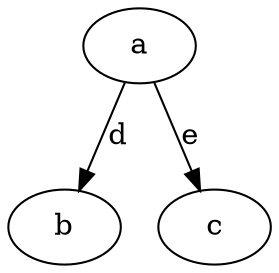
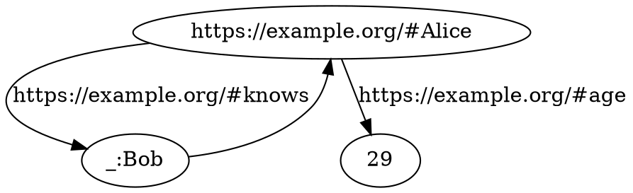
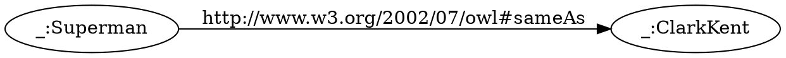
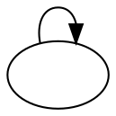

# RDF Basics

The Resource Description Framework (RDF) is a very simple but powerful data-model designed for the Semantic Web.
In this model, every piece of data is a node in a labeled directed graph. Each
node is called a **Resource**, and resources are connected together using
*properties*, which are resources themselves.

<div align="center">


</div>

In this example, `a`, `b`, `c`, `d` and `e` are all resources.

## Lexical Representations

Resources are given *lexical representations* that uniquely identify them across
the Web and give them meaning.
There are three kind of lexical representations a resource can have:
  - [International Resource Identifiers (IRI)][iri], similar to URLs but with
    international characters;
	Example: `https://example.org/Ῥόδος`
  - [Literal values][literals] (a text string, a number, etc.);
  - [Blank node identifiers][blank-ids], that locally identifies a resource in a
    given RDF document. Blank node identifiers do not cross document boundaries
    and are solely used to give a temporary name to nameless resources.
	Such identifiers are similar to IRIs with `_` as scheme.
	Example: `_:SomeAnonymousResource`.

[iri]: <https://datatracker.ietf.org/doc/html/rfc3987>
[literals]: <https://w3c.github.io/rdf-primer/spec/#section-literal>
[blank-ids]: <https://w3c.github.io/rdf-primer/spec/#section-blank-node>

<div align="center">


</div>

Lexical representation are also used to define of some proper textual syntaxes
for RDF, such as [N-Triples][n-triples] or [RDF-Turtle][rdf-turtle].
In the document, we will primarily use the N-Triples syntax to write RDF
datasets.
In this syntax, a dataset is described by enumerating every edge of the graph,
a **triple** of the form `subject predicate object`, in sequence.
The `subject` is the starting point of the edge, the predicate the label of
the edge, and the object the endpoint of the edge.

[n-triples]: <https://www.w3.org/TR/n-triples/>
[rdf-turtle]: <https://www.w3.org/TR/turtle/>

Here is the above graph written as N-Triples:
```
<https://example.org/#Alice> <https://example.org/#knows> _:Bob .
<https://example.org/#Alice> <https://example.org/#age> "29"^^http://www.w3.org/2001/XMLSchema#integer .
_:Bob <https://example.org/#knows> <https://example.org/#Alice> .
```

## Interpretations

The mapping from lexical representation to resource is called an
**interpretation**. It is a partial function mapping the set of lexical
representations to the set of resources.
For instance, the following lexical dataset:

<div align="center">


</div>

can be *interpreted* into the following interpreted resource graph when the
terms `_:Superman` and `_:ClarkKent` are interpreted as the same resource
following the semantics of `http://www.w3.org/2002/07/owl#sameAs`:
<div align="center">


</div>

As shown in this example, the same resource may have more than one lexical
representation.
In this case the shape of the lexical representation of a graph may differ from
its actual shape.
Here since `_:Superman` and `_:ClarkKent` are interpreted as the same resource,
the lexical form of the graph (on top) contains two nodes, while its interpreted
form (on the bottom) contains only a single node.

## Datasets

An RDF dataset is a collection of RDF graphs. A graph can be either the *default
graph*, or a *named graph*. A named graph is also a resource.

TODO example

The N-Quads syntax can be used to represent RDF datasets.
It is similar to the N-Triples syntax showed previously above, but lists *quads*
instead of *triple*, where an optional fourth parameter is here to specify in
which named graph the triple occurs. If no fourth parameter is specified, it
means the triple appears in the default graph.

TODO example